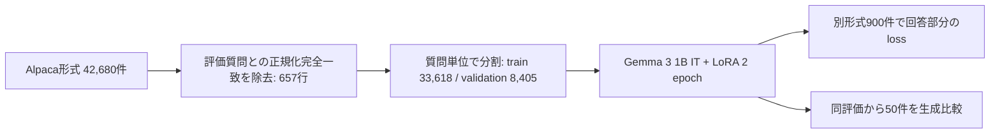

# IFC/BIM question answering with Gemma 3 1B and LoRA

Gemma 3 1B IT に IFC/BIM の質問応答を追加学習し、重複除去後の評価で何が改善し、何が残ったかを記録した実験です。Kaggle 向けの学習コード、集計結果、50問の生成比較を公開しています。

> **結果の要約:** 別形式の評価データ900件の回答部分の loss は **5.0349 → 1.4989**。生成50問の単語一致指標も改善しました。一方で、WHERE ルールや属性の取り違え、反復、一般的な質問への誤答があり、IFC 仕様の正確性を保証するものではありません。

詳細な背景と図解は [Zenn 記事「LLMはIFCを理解できるのか？」](https://zenn.dev/onestruction/articles/70daae53d48f02) を参照してください。

**Project status:** 保存済みの実験出力を整理した研究記録です。このrepositoryだけで再学習した結果ではありません。学習済みadapterと生データは同梱していません。

## 評価の流れ

`results/metrics.csv` は数値の確認用、`results/before_after_generation_gemma_subset.csv` は正誤の具体例を読むための資料です。900件のloss低下を50件のROUGE/BLEUと混同しないよう、両者を分けて記録しています。

## 結果

| 指標 | 学習前 | 学習後 | 対象 |
| --- | ---: | ---: | --- |
| 回答部分の loss | 5.0349 | 1.4989 | 別形式の評価900件 |
| ROUGE-1（簡易実装） | 0.1370 | 0.2040 | 生成50件 |
| ROUGE-L（簡易実装） | 0.0973 | 0.1636 | 生成50件 |
| BLEU（簡易実装） | 0.0174 | 0.0502 | 生成50件 |

同じデータセット由来の Validation 8,405件では loss が 3.9157 → 0.0662 でした。こちらはデータの表現形式への適応も強く反映するため、上の別形式評価と分けて示しています。数値の出典と評価上の注意は [実験レポート](reports/experiment_log.md) にまとめました。

## 評価データの重複を除去

学習元42,680件のうち、評価データの質問と正規化後に完全一致する**学習側の行657件**を、分割前に除外しました。657件は回答も一致していました。残り42,023件を学習33,618件と Validation 8,405件に分割し、評価900件はそのまま保持しています。除外後、学習・Validation と評価の正規化完全一致は0件です。657は評価側の一致行数ではないため、「評価900件の73%が重複」とは表現しません。言い換え・意味的な近似重複は検査していません。

## リポジトリの内容

| ファイル | 内容 |
| --- | --- |
| [`notebooks/retrain_gemma3_lora.py`](notebooks/retrain_gemma3_lora.py) | Kaggle GPU 向け学習・評価スクリプト |
| [`reports/experiment_log.md`](reports/experiment_log.md) | 実験設定、結果、生成例の読み方、制約 |
| [`results/metrics.csv`](results/metrics.csv) | 集計指標の機械可読な抜粋 |
| [`results/data_contamination_report.csv`](results/data_contamination_report.csv) | 重複確認の原本集計 |
| [`results/token_length_coverage.csv`](results/token_length_coverage.csv) | 最大トークン長ごとのカバー率 |
| [`results/before_after_generation_gemma_subset.csv`](results/before_after_generation_gemma_subset.csv) | 50問の質問・参照回答・学習前後の生成回答 |

公開するCSVには評価データ由来の質問と参照回答を含みます。出典は [Dietmar2020/ifc-bim-gemma3-subset-1k](https://huggingface.co/datasets/Dietmar2020/ifc-bim-gemma3-subset-1k)（MIT）です。学習データの全文、チェックポイント、W&B ログ、LoRA adapter 本体はこのリポジトリには含めません。数値CSVは元の出力からローカル実行パスを省いた抜粋です。

## 再現方法

1. Kaggle Notebook の GPU accelerator を有効にします。元の実験は NVIDIA RTX PRO 6000 で実施しました。
2. 利用条件を確認して、[Gemma 3 1B IT](https://huggingface.co/google/gemma-3-1b-it)、[Alpaca 学習データ](https://huggingface.co/datasets/Dietmar2020/ifc-bim-high-quality-alpaca)、[Gemma 評価データ](https://huggingface.co/datasets/Dietmar2020/ifc-bim-gemma3-subset-1k) を Hugging Face Datasets の保存形式で `/kaggle/input` 以下に配置します。スクリプトはディレクトリ名に含まれる識別子で探索します。
3. Python環境に `numpy`, `torch`, `pandas`, `matplotlib`, `datasets`, `transformers`, `peft` を用意します。`wandb` は任意です。元実験の厳密なパッケージバージョンは記録されていないため、ここでは再現可能なlockfileや互換性を保証しません。
4. [`notebooks/retrain_gemma3_lora.py`](notebooks/retrain_gemma3_lora.py) の冒頭にある `WORK_ROOT` と `/kaggle/input` 探索、出力先、GPU精度設定を確認してから、Kaggleの使い捨て環境で実行します。スクリプトはデータセットを `load_from_disk` で読み込みます。元のKaggle環境に合わせた実験用コードで、一般的なワンコマンド実行を保証しません。

この公開リポジトリの更新作業では GPU 再学習を実行していません。結果は保存済み出力のCSVと生成例に基づきます。スクリプトは `/kaggle/working` 内の同名ディレクトリを作り直すので、使い捨ての実行環境で実行してください。

**権利の確認:** 評価CSVには第三者データ由来の質問・参照回答を含みます。出典と表示ライセンスは上記の通りですが、公開済みCSVへの再配布適合性は所有者による確認が必要です。ベースモデルの利用条件も別途確認してください。このrepository自体のライセンスも未設定です。

## 実験設定

Gemma 3 1B IT に通常の LoRA（量子化なし）を適用し、回答部分だけを loss 対象として2 epoch 学習しました。LoRA rank 16、alpha 32、dropout 0.05、batch size 4、learning rate 1e-4、bfloat16、max length 1536。Attention と MLP の投影層7種を対象としています。詳しくは [実験レポート](reports/experiment_log.md) を参照してください。

この実験の結論は、**同一ドメインの別形式データへの適応は確認できたが、内容の正確性は別途検証が必要**、というものです。
