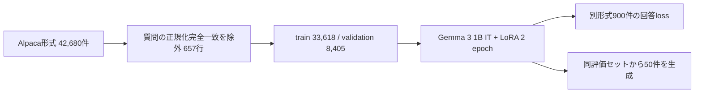

# IFC/BIM question answering with Gemma 3 1B and LoRA

An experiment adapting Gemma 3 1B IT for IFC/BIM question answering with LoRA. This repository records the training and evaluation workflow, exact-question overlap checks, aggregate metrics, and 50 generated comparisons. The reported metrics do not establish factual correctness.

IFC/BIM の質問応答を Gemma 3 1B IT に追加学習し、重複除去後の評価結果と生成例を記録した実験です。背景と図解は [Zenn の記事](https://zenn.dev/onestruction/articles/70daae53d48f02) を参照してください。

> **結果の要約:** 別形式の評価データ900件の回答部分の loss は **5.0349 → 1.4989**。生成50問のROUGE/BLEUも上昇しました。一方、WHEREルールや属性の取り違え、反復、一般質問への誤答が残っており、IFC仕様の正確性は保証しません。

**Project status:** 保存済みの実験出力を整理した研究記録です。今回の公開準備では学習を再実行していません。学習済みadapterと学習データ全文は同梱していません。

## 実験と評価

学習元42,680件から、評価質問と正規化後に完全一致する**学習側の657行**を分割前に除外しました。657行は質問・回答の両方が一致していました。残り42,023件を学習33,618件、Validation 8,405件に分割し、評価900件は保持しました。除外後の学習・Validation・評価間に、正規化完全一致の質問はありません。657は学習側の行数であり「評価900件の73%が重複」という意味ではありません。言い換えや意味的な近似重複は調べていません。詳細は [重複検査結果](results/data_contamination_report.csv) を参照してください。

| 指標 | 学習前 | 学習後 | 対象 |
| --- | ---: | ---: | --- |
| 回答部分の loss | 5.0349 | 1.4989 | 別形式の評価900件 |
| ROUGE-1（簡易実装） | 0.1370 | 0.2040 | 生成50件 |
| ROUGE-L（簡易実装） | 0.0973 | 0.1636 | 生成50件 |
| BLEU（簡易実装） | 0.0174 | 0.0502 | 生成50件 |

同じ学習元データセット由来のValidation 8,405件では loss が3.9157から0.0662に下がりました。Validationは学習データと同じ元データ由来なので、データ形式への適応も強く反映します。評価900件も同じ公開者のIFC/BIM領域のデータであり、独立した外部ベンチマークではありません。ROUGE/BLEUはコード内の簡易実装による50件の相対比較で、技術的な正しさを測定しません。生成比較には、ルールの取り違え、属性名の誤り、反復、一般質問への誤答が記録されています。詳細は[実験レポート](reports/experiment_log.md)と[50問の比較CSV](results/before_after_generation_gemma_subset.csv)を参照してください。

## 実験時に識別できる環境情報

| 項目 | 確認できる情報 | 記録されていない情報 |
| --- | --- | --- |
| Python | Pythonスクリプトで実行 | 正確なPythonバージョン |
| 主なライブラリ | `torch`, `transformers`, `datasets`, `peft`, `numpy`, `pandas`, `matplotlib` を使用 | 実験時の各バージョン |
| ベースモデル | Hugging Face ID: `google/gemma-3-1b-it` | Hugging Face revision / commit hash と tokenizer のrevision |
| 学習データ | `Dietmar2020/ifc-bim-high-quality-alpaca` 相当、元42,680行。ローカルの保存済みデータから読込 | データrevision / commit hash / artifact checksum |
| 評価データ | `Dietmar2020/ifc-bim-gemma3-subset-1k` 相当。実際に評価した行数900 | データrevision / commit hash / artifact checksum |
| GPU | NVIDIA RTX PRO 6000、bfloat16。run summary の最大reserved memoryは約18.44 GB | GPU driver / CUDA runtime の正確なバージョン |

コード、README、保存済みレポートに残っている識別情報を記載しています。依存ライブラリのバージョン、モデルとデータの取得時revision、Python、CUDAの正確な値は記録から確認できませんでした。現在の公開元のrevisionを過去の実験で使用したrevisionとみなすことはできません。

このため、実験当時の環境を完全に固定するlockfileは作れません。`requirements.txt` はコードから確認できる直接依存パッケージの一覧で、**バージョン固定ファイルではありません**。未記録の版を推測して固定すると実験環境と異なる可能性があるため、固定値は捏造していません。PyTorchはCUDAに合うwheelの選定が必要なため、別途インストールしてください。再実験する際はPython、全パッケージ、CUDA/driver、model/dataset revisionsとchecksumを記録した後、その環境をlockしてください。

## 再現手順と必要条件

1. Python環境を作成し、利用するGPUに合うPyTorch buildを導入します。その後、`pip install -r requirements.txt` を実行します。任意のW&B記録を使う場合だけ `wandb` も導入してください。
2. ベースモデル `google/gemma-3-1b-it` と、以下のデータセットを利用条件に従って取得します。
   - 学習: [Dietmar2020/ifc-bim-high-quality-alpaca](https://huggingface.co/datasets/Dietmar2020/ifc-bim-high-quality-alpaca)
   - 評価: [Dietmar2020/ifc-bim-gemma3-subset-1k](https://huggingface.co/datasets/Dietmar2020/ifc-bim-gemma3-subset-1k)
3. モデルはconfig・重み・tokenizerを含むローカルディレクトリ、データは `datasets.save_to_disk` で保存した形式にします。スクリプトはデータを `load_from_disk` で読み込み、評価用DatasetDictに `train` と `test` があれば結合します。
4. [学習・評価スクリプト](notebooks/retrain_gemma3_lora.py)の入力検索先、作業ディレクトリ、出力先を実行環境に合わせて確認し、GPUを利用できる環境で実行します。スクリプトは作業ディレクトリ内の同名フォルダを削除して作り直すため、既存データのない使い捨て環境を使ってください。

必要なGPUメモリは一律に確定できません。記録された実行では最大allocatedが約16.98 GB、最大reservedが約18.44 GBでした。bfloat16に対応し、少なくともこの実測値を超える空きメモリを確保できるGPUを使ってください。別GPUでの動作や再現性は確認していません。

## リポジトリ内の成果物

| パス | 内容 |
| --- | --- |
| [`notebooks/retrain_gemma3_lora.py`](notebooks/retrain_gemma3_lora.py) | 学習・評価コード |
| [`requirements.txt`](requirements.txt) | 直接依存パッケージ一覧（非固定） |
| [`reports/experiment_log.md`](reports/experiment_log.md) | 設定、評価結果、生成例の解釈と限界 |
| [`results/metrics.csv`](results/metrics.csv) | 集計指標 |
| [`results/data_contamination_report.csv`](results/data_contamination_report.csv) | 重複検査の集計 |
| [`results/token_length_coverage.csv`](results/token_length_coverage.csv) | 最大系列長ごとのカバー率 |
| [`results/before_after_generation_gemma_subset.csv`](results/before_after_generation_gemma_subset.csv) | 50問の質問・参照回答・学習前後の生成 |

評価比較CSVには第三者データセット由来の質問・参照回答が含まれます。出典は上記の評価データセット（公開カード記載のMIT）です。学習データ全文、モデル重み、LoRA adapter、チェックポイント、認証情報は含めません。データ・モデルの利用条件は各提供元で確認してください。このrepository自体のライセンスは未設定です。

## 実験設定

Gemma 3 1B ITに通常のLoRA（量子化なし）を適用し、回答部分だけをloss対象として2 epoch学習しました。rank 16、alpha 32、dropout 0.05、batch size 4、gradient accumulation 1、learning rate 1e-4、bfloat16、max length 1536。LoRA対象はAttentionとMLPの投影層7種です。保存済み結果は[実験レポート](reports/experiment_log.md)に基づきます。この公開準備では学習を再実行していません。

この実験から確認できるのは、重複除去後の同一ドメイン別形式データに対するlossと表層一致指標の改善です。IFCスキーマの理解や実務上の正確性が確立したとは結論できません。
